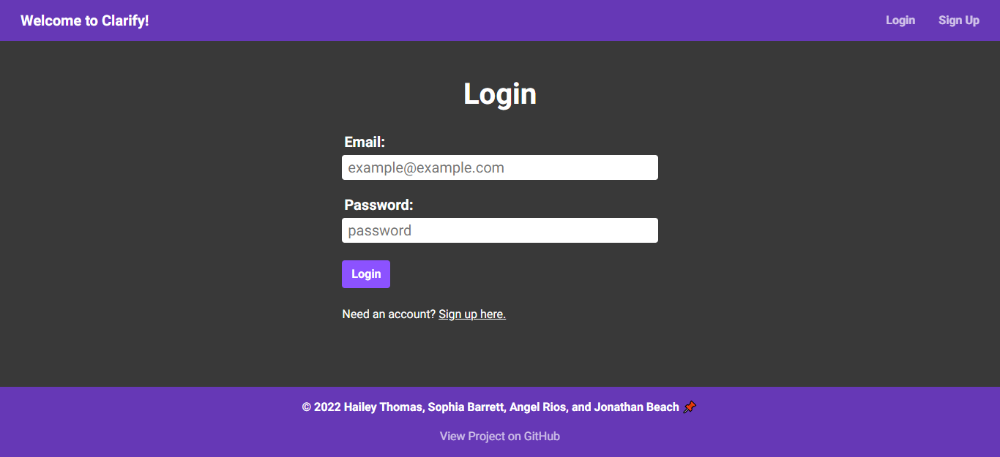
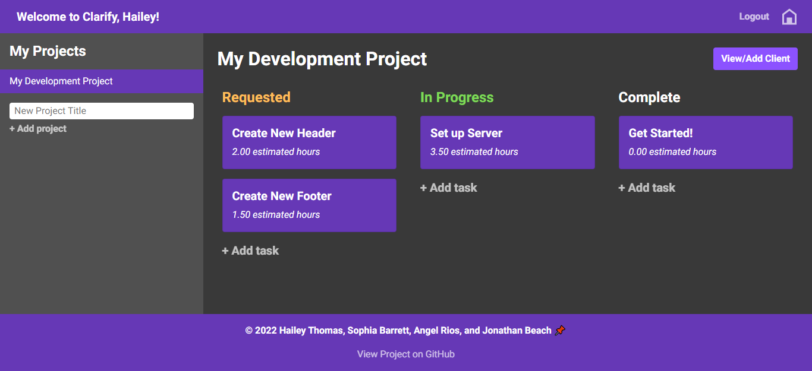
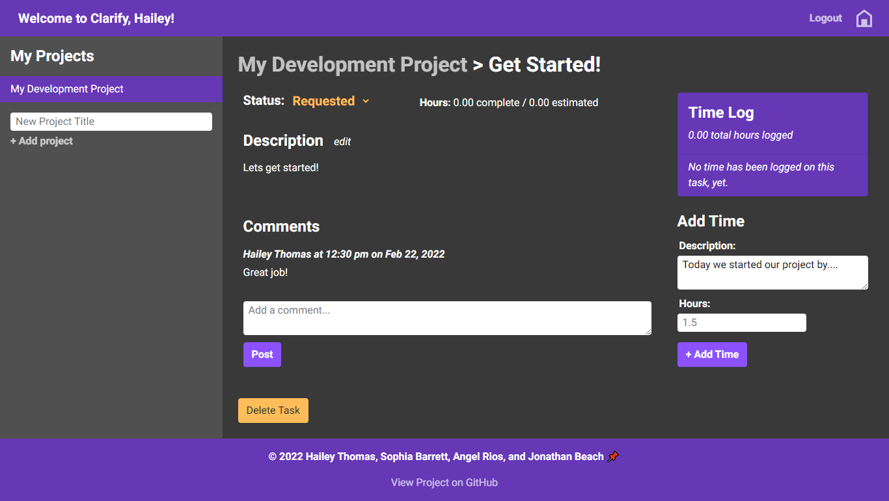
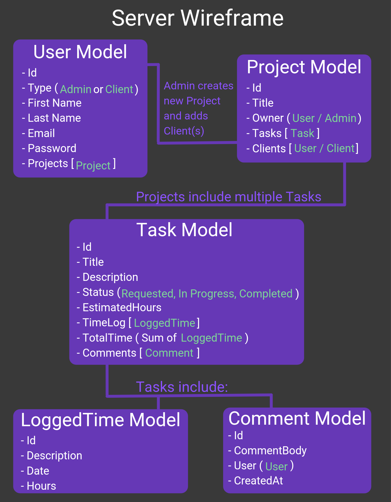
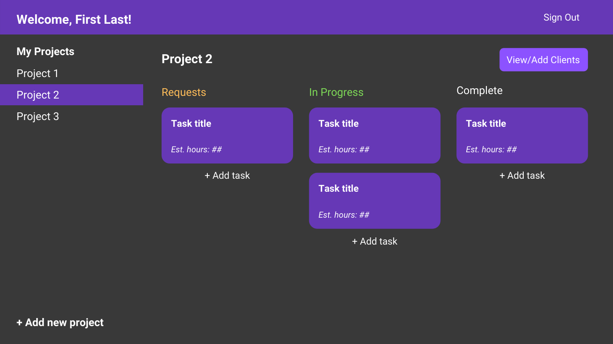
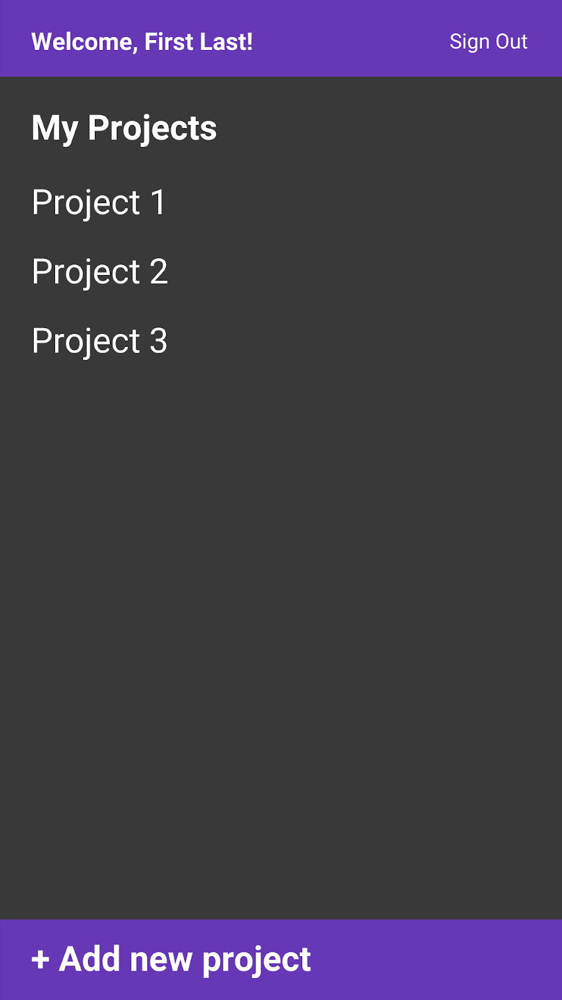
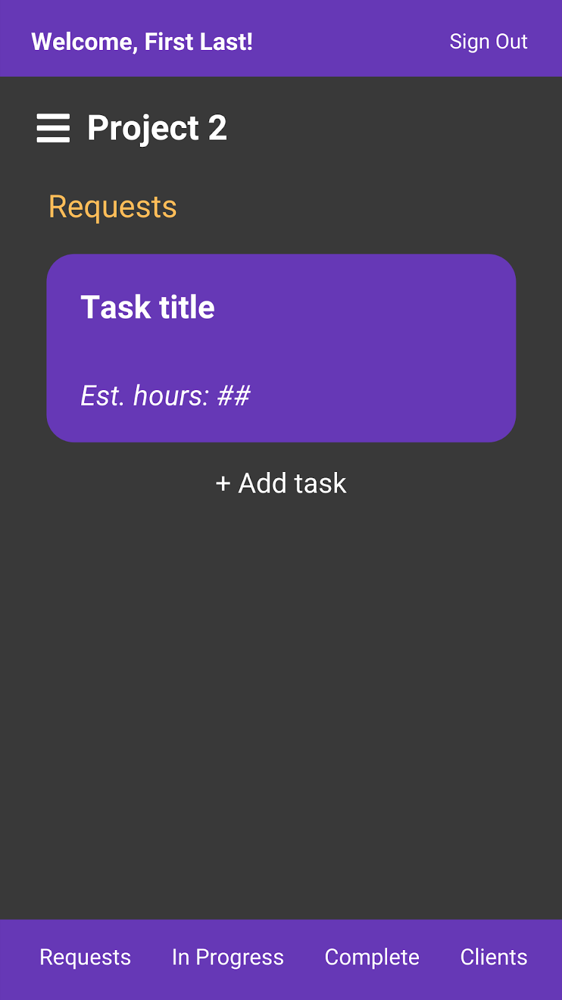
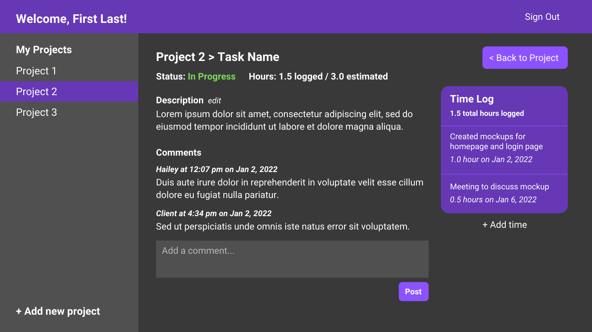
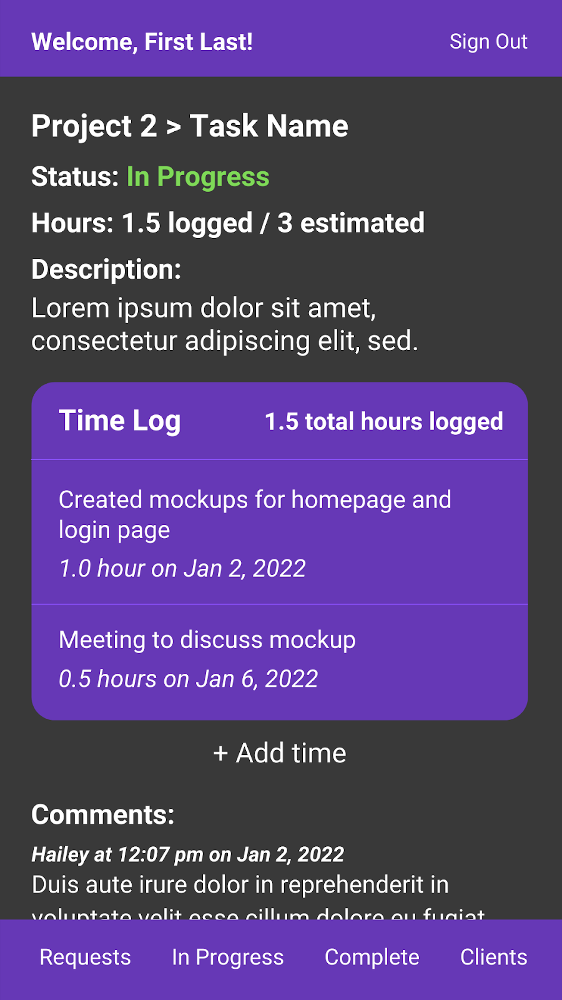

# To Clarify 🔍

    

## Description

> For me the greatest beauty always lies in the greatest clarity.
> ✒️ Gotthold Ephraim Lessing

To Clarify is a full stack MERN web application designed to help freelance web developers keep workflow organized and to establish clarity and transparency with clients. We wanted to create a space where web developers could easily create, review and track every step of the development process and have this information readily available to their clients. To make sure projects are exactly how a client and developer wishes, they can communicate with each other in every task. Time logs and estimated hours help keep transparency and a clear picture of the status of the project. We are very excited about the possibilities of To Clarify and the problem it helps solve in the industry.

## Table of Contents

- [Usage](#usage)
- [Development](#development)
- [Credits](#credits)
- [License](#license)

## Usage

- Visit deployed link below to launch web application.
- If logged out, user is taken to a login page where they can log in or click to go to the sign up page.
- Once logged in, user will see their Project List where their projects are stored and where they can add a new project.
- User will also see their Project Area that includes all requested, in progress and completed tasks. They will be able to add clients as well as add Tasks in their Project Area.
- User can click on a task to bring up the Task Detail page where they can view all information on a task, edit the status or description of the task, log hours and comment.

### Screenshots

- 
- 
- 

### Links

- [DeployedLink](http://toclarifyapp.herokuapp.com) - link to deployed website
- [GitHub](https://github.com/Teeemster/ToClarify) - link to GitHub project

## Development

### Server Wireframe

### Front End Wireframe

#### Project Area

 

#### Task Detail

### Future Development

- Timer for tracking time spent on tasks
- Progress bar to display total estimated hours for project vs total time logged on project so far (sum of all task hours)
- Ability to create invoices from completed tasks
- Dark mode and light mode options

## Credits

    

## License

 [Click here to view MIT License](https://opensource.org/licenses/MIT)

Copyright (c) [2022] [Hailey Thomas, Sophia Barrett, Angel Rios, and Jonathan Beach]

Permission is hereby granted, free of charge, to any person obtaining a copy
of this software and associated documentation files (the "Software"), to deal
in the Software without restriction, including without limitation the rights
to use, copy, modify, merge, publish, distribute, sublicense, and/or sell
copies of the Software, and to permit persons to whom the Software is
furnished to do so, subject to the following conditions:

The above copyright notice and this permission notice shall be included in all
copies or substantial portions of the Software.

THE SOFTWARE IS PROVIDED "AS IS", WITHOUT WARRANTY OF ANY KIND, EXPRESS OR
IMPLIED, INCLUDING BUT NOT LIMITED TO THE WARRANTIES OF MERCHANTABILITY,
FITNESS FOR A PARTICULAR PURPOSE AND NONINFRINGEMENT. IN NO EVENT SHALL THE
AUTHORS OR COPYRIGHT HOLDERS BE LIABLE FOR ANY CLAIM, DAMAGES OR OTHER
LIABILITY, WHETHER IN AN ACTION OF CONTRACT, TORT OR OTHERWISE, ARISING FROM,
OUT OF OR IN CONNECTION WITH THE SOFTWARE OR THE USE OR OTHER DEALINGS IN THE
SOFTWARE.

## Contribution

### Contributor Covenant Code of Conduct

#### Our Pledge

We as members, contributors, and leaders pledge to make participation in our
community a harassment-free experience for everyone, regardless of age, body
size, visible or invisible disability, ethnicity, sex characteristics, gender
identity and expression, level of experience, education, socio-economic status,
nationality, personal appearance, race, caste, color, religion, or sexual
identity and orientation.

We pledge to act and interact in ways that contribute to an open, welcoming,
diverse, inclusive, and healthy community.

#### Our Standards

Examples of behavior that contributes to a positive environment for our
community include:

- Demonstrating empathy and kindness toward other people
- Being respectful of differing opinions, viewpoints, and experiences
- Giving and gracefully accepting constructive feedback
- Accepting responsibility and apologizing to those affected by our mistakes,
  and learning from the experience
- Focusing on what is best not just for us as individuals, but for the overall
  community

Examples of unacceptable behavior include:

- The use of sexualized language or imagery, and sexual attention or advances of
  any kind
- Trolling, insulting or derogatory comments, and personal or political attacks
- Public or private harassment
- Publishing others' private information, such as a physical or email address,
  without their explicit permission
- Other conduct which could reasonably be considered inappropriate in a
  professional setting

#### Enforcement Responsibilities

Community leaders are responsible for clarifying and enforcing our standards of
acceptable behavior and will take appropriate and fair corrective action in
response to any behavior that they deem inappropriate, threatening, offensive,
or harmful.

Community leaders have the right and responsibility to remove, edit, or reject
comments, commits, code, wiki edits, issues, and other contributions that are
not aligned to this Code of Conduct, and will communicate reasons for moderation
decisions when appropriate.

#### Scope

This Code of Conduct applies within all community spaces, and also applies when
an individual is officially representing the community in public spaces.
Examples of representing our community include using an official e-mail address,
posting via an official social media account, or acting as an appointed
representative at an online or offline event.

#### Enforcement

Instances of abusive, harassing, or otherwise unacceptable behavior may be
reported to the community leaders responsible for enforcement at
[INSERT CONTACT METHOD].
All complaints will be reviewed and investigated promptly and fairly.

All community leaders are obligated to respect the privacy and security of the
reporter of any incident.

#### Enforcement Guidelines

Community leaders will follow these Community Impact Guidelines in determining
the consequences for any action they deem in violation of this Code of Conduct:

##### 1. Correction

**Community Impact**: Use of inappropriate language or other behavior deemed
unprofessional or unwelcome in the community.

**Consequence**: A private, written warning from community leaders, providing
clarity around the nature of the violation and an explanation of why the
behavior was inappropriate. A public apology may be requested.

##### 2. Warning

**Community Impact**: A violation through a single incident or series of
actions.

**Consequence**: A warning with consequences for continued behavior. No
interaction with the people involved, including unsolicited interaction with
those enforcing the Code of Conduct, for a specified period of time. This
includes avoiding interactions in community spaces as well as external channels
like social media. Violating these terms may lead to a temporary or permanent
ban.

### 3. Temporary Ban

**Community Impact**: A serious violation of community standards, including
sustained inappropriate behavior.

**Consequence**: A temporary ban from any sort of interaction or public
communication with the community for a specified period of time. No public or
private interaction with the people involved, including unsolicited interaction
with those enforcing the Code of Conduct, is allowed during this period.
Violating these terms may lead to a permanent ban.

##### 4. Permanent Ban

**Community Impact**: Demonstrating a pattern of violation of community
standards, including sustained inappropriate behavior, harassment of an
individual, or aggression toward or disparagement of classes of individuals.

**Consequence**: A permanent ban from any sort of public interaction within the
community.

#### Attribution

This Code of Conduct is adapted from the [Contributor Covenant][homepage],
version 2.1, available at
[https://www.contributor-covenant.org/version/2/1/code_of_conduct.html][v2.1].

Community Impact Guidelines were inspired by
[Mozilla's code of conduct enforcement ladder][mozilla coc].

For answers to common questions about this code of conduct, see the FAQ at
[https://www.contributor-covenant.org/faq][faq]. Translations are available at
[https://www.contributor-covenant.org/translations][translations].

[homepage]: https://www.contributor-covenant.org
[v2.1]: https://www.contributor-covenant.org/version/2/1/code_of_conduct.html
[mozilla coc]: https://github.com/mozilla/diversity
[faq]: https://www.contributor-covenant.org/faq
[translations]: https://www.contributor-covenant.org/translations

## Tests

To test out our Apollo Server, download the code and open up project in GraphQL.

## Questions

For any questions please feel free to contact one of the developers below.

### Contact

- [GitHub](https://github.com/Teeemster) - Jonathan Beach
- [GitHub](https://github.com/sophiabarrett) - Sophia Barrett
- [GitHub](https://github.com/arios10) - Angel Rios
- [GitHub](https://github.com/HaileyThomas) - Hailey Thomas
